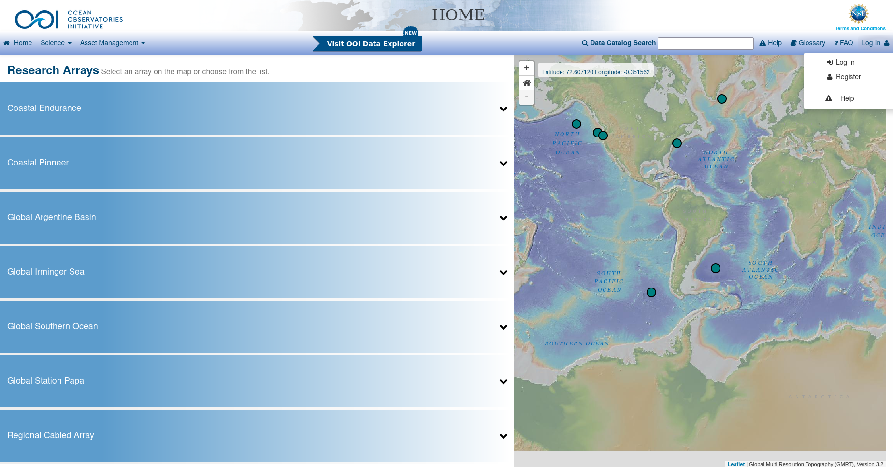
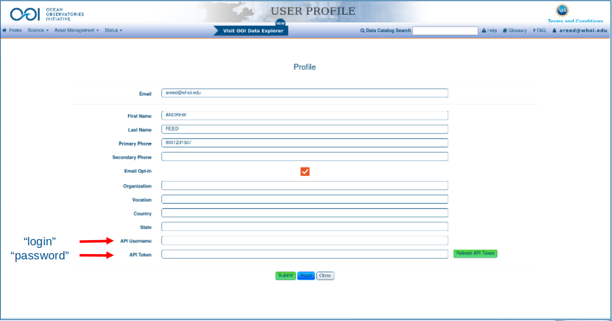

# NE Pacific Community Workshop
Author: Andrew Reed

---
## Overview
Welcome. This repo contains the presentation, scripts, handouts, documents, and supporting data used by me to prepare for the Ocean Observatories Initiative Facilities Board's Northeast Pacific Community Workshop, held June 7-9, 2022, in Portland, Oregon. This repo is split into two different sections. The **Poster** directory contains the notebooks, figures, and supporting documents necessary to recreate the analysis and figures presented on my poster **Global Ocean Station Papa: Assets & Datasets**. The **tutorial** directory contains both the presentation **Using M2M: Programmatic Interaction with OOI Data & Metadata**, an companion jupyter notebook ```**M2M_tutorial.ipynb**```, and a supporting python code package ```**pyOOI**```.

Currently all the scripts and functions are written in python. Hopefully soon MatLab options will be added.

## Setup
The example given below are for use with a terminal window. If you are on a windows machine, I strongly recommend you have or install git bash for windows. A good tutorial on how to install that can be found [here](https://www.geeksforgeeks.org/working-on-git-bash/).

1. **OOI Credentials**
In order to download data from the OOI data portal and via the M2M API, you first need to register at ooinet.oceanobseravtories.org and get an API username and token. If you have not done so, follow these steps:
  *  Navigate to the [OOI Data Portal](ooinet.oceanobseravtories.org)
  * At the upper right of the page, click the "login"
  * Once you are logged in, navigate to your user profile in the upper right of the screen.

  <figure>
  
  </figure><b>


  * On your user profile page, save the "API Username" and "API Token"

  <figure>
  
  </figure>

2. **Save your credetials**

  Following the instructions from the ooi-data-explorations, we'll utilize the netrc module to store your credentials on your local machine.
```
cd ~
touch .netrc
chmod 600 .netrc
cat <<EOT >> .netrc
machine ooinet.oceanobservatories.org
    login <API Username>
    password <API Token>
EOT
```

3. **Get the repo**

  Next, you can follow the instructions on gitHub to clone the repo to your machine:
```
# Navigate to where you want to store the repo
cd ~/Documents/
git clone git@github.com:reedan88/NE-Pacific-Community-Workshop
```

4. **Setup python environment**

  ts recommended that miniconda or anaconda3 has been installed.  Then you can make the local environment directly from the environment.yaml file included in this repo:

    ```
    conda env create -f environment.yaml
    conda activate ne_pacific_community_workshop
    ```

5. **Launch jupyter notebooks**
Now you are ready to get working with OOI data! Launch a jupyter notebook in your browser and get ready to explore OOI carbon system data.

---
### Project Files and Structure Description
---
#### Dependencies
The example notebooks in this repo rely heavily on packages, functions, and routines that have been developed over the years by the OOI operators to assist in processing and working with OOI data. There are two principle packages on which the example notebooks lean are:

* ##### pyOOI
> The modules and tools within this package are designed to assist in requesting, importing, and downloading from the Ocean Observatories Initiative API by M2M requests. It is included in this repo for ease of access. There are two options for utilizing it. The first is to add it to your local path. The second is to install it as a local development package.

```
# Option 1: Add it to your working path
import sys
sys.path.append("~/NE-Pacific-Community-Workshop/Tutorial/src")
from pyOOI import *

# Option 2: Install it as a local package
cd "~/NE-Pacific-Community-Workshop/Tutorial"
pip install -e .
```

* ##### OOI-Data-Explorations
> Explorations of Ocean Observatories Initiative Datasets via MATLAB, Python, R, and Julia. It can be found at https://github.com/oceanobservatories/ooi-data-explorations.

These repos are not distributed on either conda or pip, so they will need to be either cloned to your local machine or the files and functions directly downloaded.

---
### Sections
#### Poster
##### scripts
* **Download_Data.ipynb**
> The purpose of this notebook is to identify and download the datasets with pH and pCO2 data deployed at the Ocean Observatory Initiative's (OOI) Global Ocean Station Papa Array (60$^{\circ}$N, 39$^{\circ}$W). OOI deploys the following sensors for measuring the ocean carbon system: Sunburst Sensors, LLC. SAMI-pH (PHSEN) pH, SAMI-pCO$_{2}$ seawater measurements, and the Pro-Oceanus pCO2 sensor measurements. The datasets identified here are used in the **```Poster```** notebook.

* **Bottle_Data.ipynb**
> This notebook provides a quick outline and example of working with OOI Discrete Summary Spreadsheet bottle data. It includes how to load it, how to parse data quality flags, how to derive some important values, and work with the data to make it easy to use for data validation and comparison purposes.

* **Poster.ipynb**
> This notebook recreates Figures 2 through 4 on the poster **Global Ocean Station Papa: Assets & Datasets**. It relies on running ```Download_Data.ipynb``` and ```Bottle_data.ipynb``` beforehand in order to download and prepare the input datasets.

##### documents

##### figures
A folder containing the static images from Figure 1 and Table 1 in the Poster, as well as the images for the Overview to the Poster.

##### data
Empty directory except for water sampling data. Setup ready to store intermediate and final datasets generated by the notebooks in this section.
* * **```Ship_Data/```** - directory containing the Global Ocean Station Papa discrete summary bottle sheets needed for the notebook **```Bottle_Data.ipynb```**


#### tutorial
##### scripts
* **M2M_Presentation.ipynb**
> This notebook is the companion to the presentation "Using M2M: Programmatic Interaction with OOI Data & Metadata" presented as part of the Ocean Observatories Facilities Board NE Pacific Community Workshop in Portland, Oregon, from June 7 - 9, 2022. The goal is to walk through how to use the Ocean Observatories Initiative's API, named Machine-2-Machine (M2M), system and examine what data can be queried and how to manipulate it to extract desired information.

* **M2M.pptx**
> This is the presentation **Using M2M: Programmatic Interaction with OOI Data & Metadata**.

##### documents
Folder which contains the presentation titled "**OOI Carbon System Data: Irminger Array" along with supporting figures and images.
* **Carbon_Presentation.pptx** - The presentation for "OOI Carbon System Data" given at Ocean Sciences 2022


##### data
An empty directory ready to store intermediate and final datasets generated by the notebooks in this section.

##### results
An empty directory ready to store figures and output from the analyses performed in this section.
